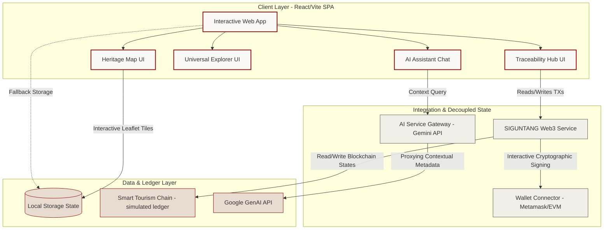
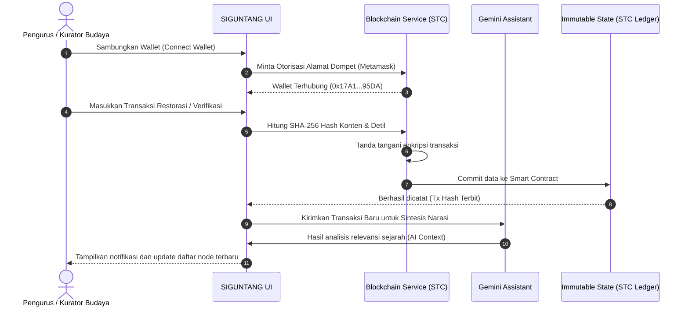
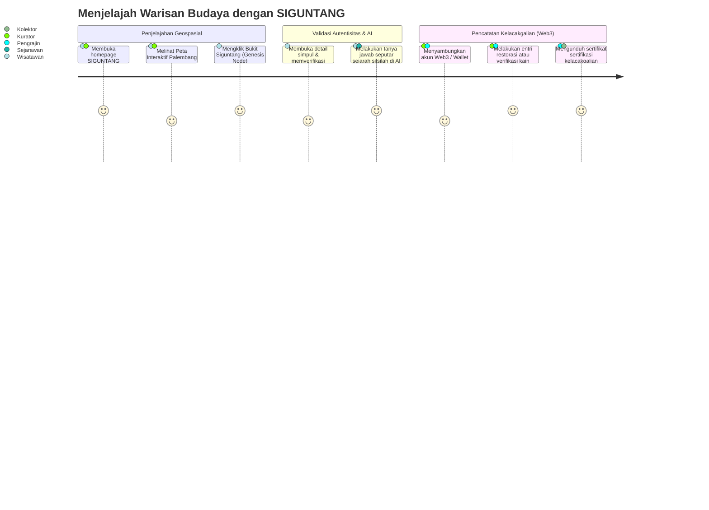
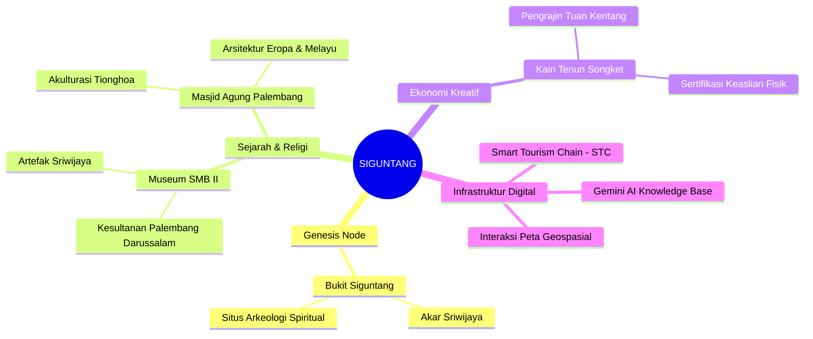
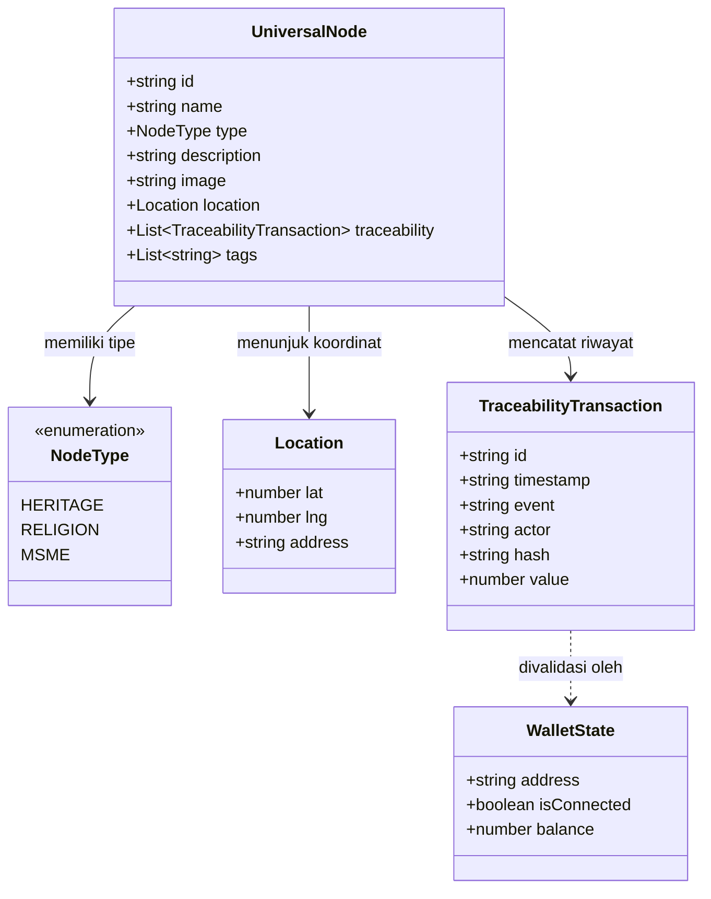

# Architecture & System Design - SIGUNTANG

SIGUNTANG (**Sistem Integrasi Gerbang Universal Node, Traceability & Artificial Intelligence Nusantara Gemilang**) adalah platform *Smart Tourism & Cultural Preservation* berbasis teknologi desentralistik dan kecerdasan buatan. Dokumen ini merincikan desain sistem, aliran data, serta modul arsitektur yang digunakan platform.

---

## 🏗️ 1. Architecture & System Topology

Topologi arsitektur SIGUNTANG membagi sistem ke dalam 3 lapisan (Layers) utama: **Client Layer (UI/UX)**, **DApp Integration & Security Layer**, serta **Data & Intelligence Layer**.

---

## 🌊 2. Data Flow Diagram

Diagram di bawah mengilustrasikan aliran penambahan riwayat kelacakgalian (*Traceability transaction*) dari pengguna yang memiliki otorisasi dompet digital (*authenticated wallet*):

---

## 🧭 3. User Journey Map

Perjalanan pengguna umum (Wisatawan/Sejarawan) dan Kurator Budaya dalam mengeksplorasi serta melestarikan warisan budaya Palembang:

---

## 🗺️ 4. Cultural Knowledge Mindmap

Struktur organisasi pengetahuan budaya (Cultural Ontology) yang dipetakan oleh platform SIGUNTANG untuk melacak warisan kolosal Bumi Sriwijaya:

---

## 🧬 5. Class Diagram (System Structure)

Hubungan kelas dan tipe struktur data yang merepresentasikan ekosistem SIGUNTANG:

---

## 🛠️ Desain Modular Kode
Sistem dibangun berdampingan dengan prinsip ketergantungan minimal dan isolasi fungsional:
*   `src/constants.ts` - Bertindak sebagai repositori tunggal data (*Single Source of Truth*) untuk data Budaya dan Koordinat Geospasial Node.
*   `src/components/HeritageMap.tsx` - Modul visualisasi spasial berbasis Leaflet Engine dengan rendering performa tinggi.
*   `src/components/TraceabilityHub.tsx` - Modul visual interaksi dengan jaringan digital STC untuk melihat serta menambahkan catatan transparan.
*   `src/services/blockchainService.ts` - Lapisan emulasi Smart Contract & integrasi Metamask dengan hash kriptografis SHA-256 demi kelayakan verifikasi nyata.
